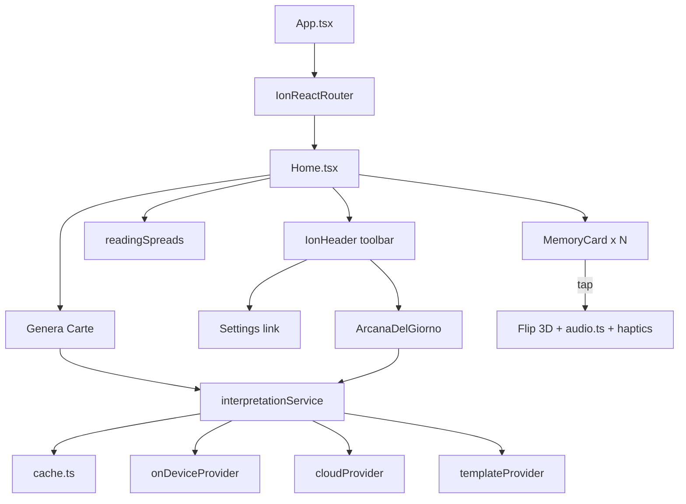

# Architecture — Tarocchi Ionic

## Flusso applicazione



## Layer

| Layer | Responsabilità |
|-------|----------------|
| `pages/` | Home, Settings, Privacy |
| `components/` | MemoryCard, ArcanaDelGiorno, Onboarding, AdBanner |
| `constants/` | Metadati 22 arcani, layout letture |
| `services/interpretation/` | Pipeline AI + cache + fallback |
| `utils/` | Arcano, audio, share, notifiche, tema |
| `hooks/` | useRainbowColor, useTheme |
| `public/assets/` | Immagini e audio |

## Interpretazioni

Nessun testo interpretativo in `cardsData.ts`. Flusso: cache → on-device LLM → cloud API (env) → generazione dinamica da keywords.

## Build pipeline

```
src/ → Vite build → dist/ → Capacitor sync → android/app/src/main/assets/
```

Plugin nativi (AdMob, local-llm) caricati con **dynamic import** su piattaforma nativa.

## Routing
- `/` → `/home`
- `/settings`, `/privacy`

## Storage locale
| Chiave | Scopo |
|--------|-------|
| `lastArcanaView` | Pallino arcano |
| `tarocchi-theme` | Tema |
| `dailyArcanaNotifications` | Notifiche |
| `tarocchi-ai-readings` | Toggle AI |
| `tarocchi-spread` | Tipo consulto |
| `tarocchi-interpretation:*` | Cache interpretazioni |
| `tarocchi-onboarding-v1` | Onboarding completato |

## Tipi di consulto
- 1 carta, 3 carte, 4 carte (classico), Croce Celtica (6) — `readingSpreads.ts`
