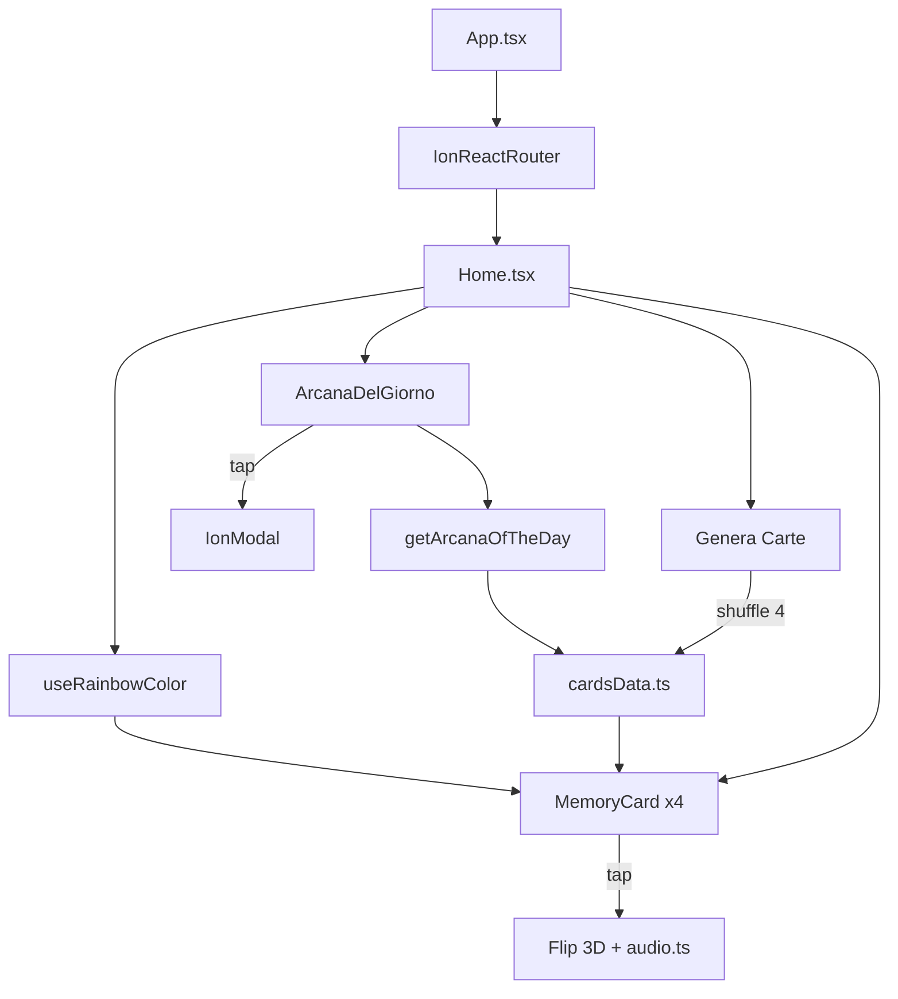

# Architecture — Tarocchi Ionic

## Flusso applicazione



## Layer

| Layer | Responsabilità |
|-------|----------------|
| `pages/` | Composizione schermata, state generazione |
| `components/` | UI riusabile (carta, modal arcano) |
| `constants/` | Dati statici 22 arcani |
| `utils/` | Logica pura (arcano, audio) |
| `hooks/` | State/effect riusabili (rainbow color) |
| `public/assets/` | Immagini e audio statici |

## Build pipeline

```
src/ → Vite build → dist/ → Capacitor sync → android/app/src/main/assets/
```

## Routing
- `/` → redirect `/home`
- Single-page: nessun tab navigator attivo (scaffold tabs rimosso)

## Storage
- `localStorage.lastArcanaView`: stringa `Date.toDateString()` per pallino notifica
- Nessun backend, nessun auth nella v1

## Riferimenti esterni
- **Taro** (web): parity UI/UX target
- **tarocchi-app** (Expo): riferimento notifiche push e reanimated (da portare in Fase 3)
